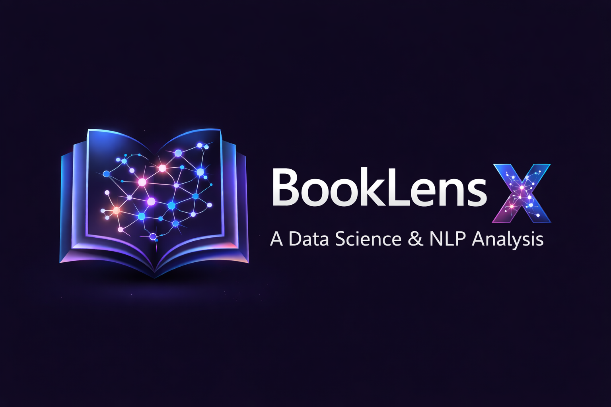

# BookLensX: AI-Powered Book Intelligence System
<p align="center">
  
</p>
> Transforming book data into intelligent insights using NLP and multi-task learning

---

## Overview

**BookLensX** is an advanced Natural Language Processing (NLP) system designed to analyze and generate insights from book data.
It leverages **transformer-based deep learning (T5)** to perform multiple tasks simultaneously:

* 📖 Genre Classification
* ⭐ Rating Prediction
* 📝 Title Generation

This project demonstrates how **multi-task learning with large language models** can extract meaningful patterns from textual data and enhance recommendation systems.

---

## Key Features

* 🔹 Multi-task learning with a single T5 model
* 🔹 Automatic genre classification from descriptions
* 🔹 Predictive rating system (regression)
* 🔹 AI-generated book titles
* 🔹 Clean and scalable ML pipeline

---

## Model Architecture

* **Model:** T5-small (Text-to-Text Transfer Transformer)
* **Approach:** Multi-task learning via task-specific prompts

### Example Input Format:

Task prefixes are used to guide the model:

* `"classify genre: <description>"`
* `"predict rating: <description>"`
* `"generate title: <description>"`

### Why T5?

* Unified text-to-text framework
* Efficient for multi-task learning
* Strong performance on NLP tasks

---

## Results

| Task                 | Metric   | Score |
| -------------------- | -------- | ----- |
| Genre Classification | Accuracy | 70%   |
| Rating Prediction    | RMSE     | 2.99  |
| Title Generation     | BLEU     | 4.00  |

---

## Example Output

**Input:**

```text
"A young wizard embarks on a journey to defeat a dark lord."
```

**Model Output:**

* Genre → Fantasy
* Rating → 4.5
* Title → *The Wizard’s Destiny*

---

## 🛠 Tech Stack

* Python
* PyTorch
* Hugging Face Transformers
* Pandas / NumPy
* Scikit-learn

---

## Project Structure

```
BookLensX/
│
├── data/               # Dataset files
├── notebooks/          # EDA & experimentation
├── src/                # Core scripts
├── models/             # Trained models
├── results/            # Evaluation outputs
├── README.md
└── requirements.txt
```

---

## ⚙️ Installation

```bash
git clone https://github.com/datazenith-labs/BookLensX-NLP-DS-Project.git
cd BookLensX-NLP-DS-Project
pip install -r requirements.txt
```

---

## ▶️ Usage

Run training:

```bash
python train.py
```

Run inference:

```bash
python inference.py
```

---

## 📈 Future Improvements

* 🔹 Deploy as a web app (Streamlit / FastAPI)
* 🔹 Fine-tune larger models (T5-base, FLAN-T5)
* 🔹 Add recommendation system
* 🔹 Improve evaluation with human feedback

---

## Contributing

Contributions are welcome! Feel free to open issues or submit pull requests.

---

## About

Developed as part of a Data Science & NLP project at HAW Hamburg.
Focused on building real-world AI applications using modern LLM techniques.

---

## ⭐ Acknowledgements

* Hugging Face 🤗
* Open-source NLP community

---
